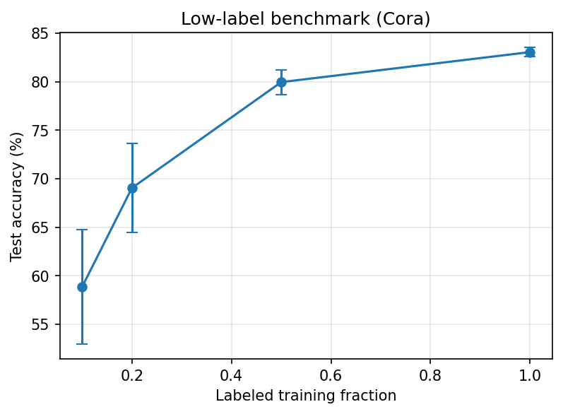
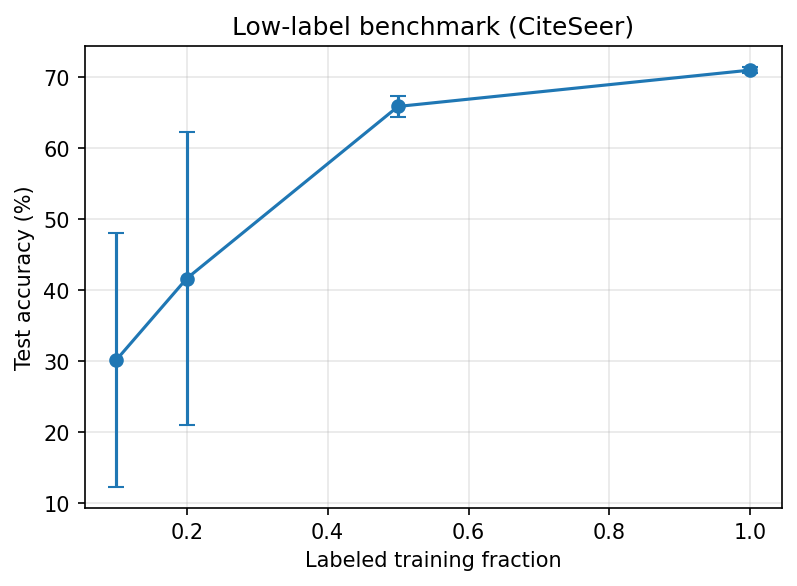
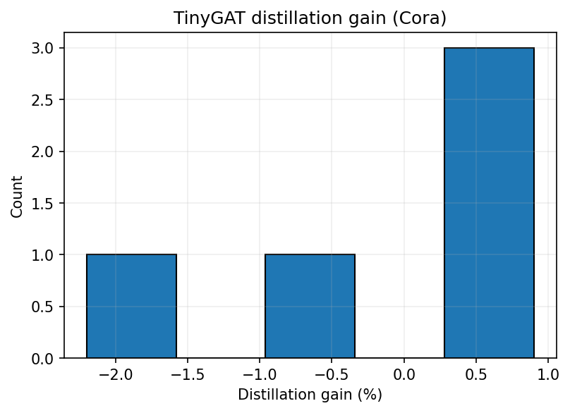
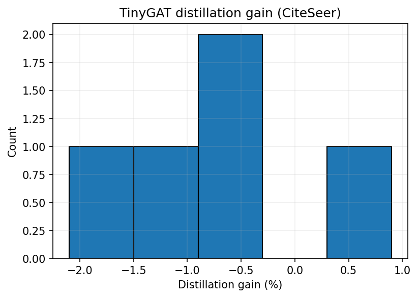
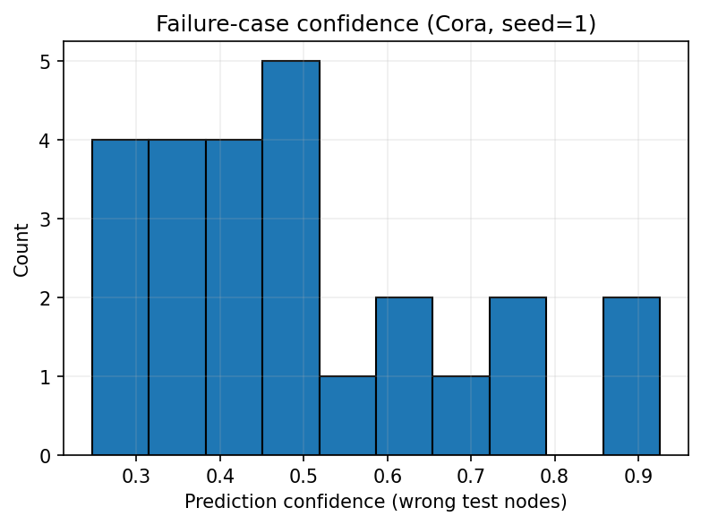
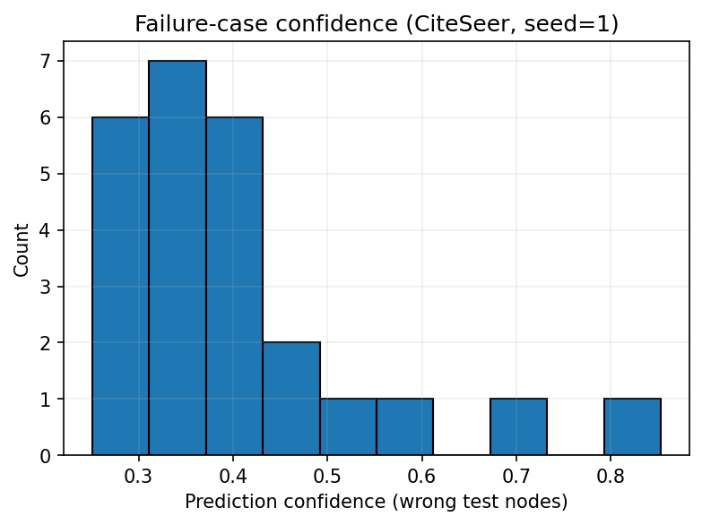

# Graph Attention Networks: Re-implementation

**CS 4782: Deep Learning | Cornell University**
Authors: Yash Chatha (yc2727), Jerry Ji (rj378), Leon Huang (lyh7)

Paper: [Graph Attention Networks, Veličković et al., ICLR 2018](https://arxiv.org/abs/1710.10903)

---

## Introduction

This reposiitory contains our reimplementation of **Graph Attention Networks (GATs)** by Veličković et al. (ICLR 2018). We reproduce **Table 2** from the paper: transductive node classification accuracy on Cora and CiteSeer averaged over 100 runs (paper: 83.0 ± 0.7% / 72.5 ± 0.7%). This is the paper's central claim that learned attention outperforms fixed-weight GCN aggregation (81.5% / 70.3%), and reproducing it validates the full architecture and training protocol. 

We also implement three extensions beyond the baseline:
- **Low-Label Benchmark:** GAT accuracy vs. fraction of training labels (0.1–1.0)
- **TinyGAT Distillation:** knowledge distillation from full GAT to a compressed student (2 heads × 4 features, ~6× fewer parameters)
- **Failure Case Explorer:** analysis of every misclassified test node (confidence, neighbor class histogram, and top attention edges)

## GitHub Contents

```
gat-reimplementation/
├── code/
│   ├── model.py      # GAT + TinyGAT model definitions (PyTorch Geometric)
│   ├── train.py      # Training loop with early stopping
│   └── evaluate.py   # 100-run evaluation, saves results to CSV
├── data/
│   └── README.md     # Dataset info (auto-downloaded via PyG)
├── notebooks/
│   └── GAT_Colab.ipynb  # Full Colab notebook: baseline + 3 extensions
├── results/          # CSVs, JSONs, and figures from all experiments
├── poster/           # Final poster PDF
├── report/           # Final report PDF
└── README.md
```

## Re-implementation Details

We implement a 2-layer GAT using PyTorch Geometric's `GATConv`, matching the paper's transductive setup:

- **Layer 1:** 8 attention heads × 8 features = 64-dim output, ELU activation, dropout 0.6
- **Layer 2:** 1 attention head → num_classes, log-softmax output, dropout 0.6
- **Optimizer:** Adam, lr=0.005, weight_decay=5e-4
- **Datasets:** Cora and CiteSeer via PyG Planetoid with NormalizeFeatures; standard public splits (20 nodes/class train, 500 val, 1000 test)
- **Evaluation:** 100 independent seeds; mean ± std test accuracy reported

**Key modification:** We monitor only validation loss for early stopping (patience=100) rather than both loss and accuracy as in the original TensorFlow implementation. We did this to ensure consistency across all experiments: our first extension, which tests performance at low label counts, introduces an instablity with respect to accuracy-based stopping.


## Reproduction Steps

**Requirements:** Python 3.8+, GPU recommended (100 runs on CPU is slow; T4 or equivalent)

**Install dependencies:**
```bash
pip install torch torch_geometric
```

**Run a single training trial:**
```bash
python code/train.py --dataset Cora
python code/train.py --dataset CiteSeer
```

**Run 100-trial evaluation (saves CSV to `results/`):**
```bash
python code/evaluate.py --dataset Cora
python code/evaluate.py --dataset CiteSeer
```

**Run extensions (low-label, distillation, failure cases):**
Open `notebooks/GAT_Colab.ipynb` in Google Colab with GPU enabled (Runtime → Change runtime type → T4 GPU) and run cells top to bottom. Results and figures are saved to `RESULTS_DIR` (default `/content/gat_results/`; mount a Drive path to persist across sessions).

## Results / Insights

### Baseline (Table 2 reproduction)

| Dataset  | Paper Result | Our Result |
|----------|-------------|------------|
| Cora     | 83.0 ± 0.7% | **83.22 ± 0.41%** | 
| CiteSeer | 72.5 ± 0.7% | **70.94 ± 0.52%** |

Cora matches and slightly exceeds the paper's target, while CiteSeer falls 1.56% short. We believe that this deviation on the CiteSeer dataset was due to the modification we made to the methedology outlined above. 

### Extension Results

**Low-Label Benchmark:** Performance degrades sharply below 50% labels, but CiteSeer collapses far more severely than Cora due to its sparser features. At 10% labels, one CiteSeer run hits 8.3%, while Cora's worst run stays above 50%:

| Label fraction | Cora labels | Cora mean | Cora std | CiteSeer labels | CiteSeer mean | CiteSeer std |
|---|---|---|---|---|---|---|
| 10% | 14 | 58.84% | ±5.90% | 12 | 30.16% | ±17.89% |
| 20% | 28 | 69.04% | ±4.60% | 24 | 41.64% | ±20.60% |
| 50% | 70 | 79.96% | ±1.26% | 60 | 65.88% | ±1.49% |
| 100% | 140 | 83.06% | ±0.48% | 120 | 71.00% | ±0.42% |




**TinyGAT Distillation:** We experience a mean distillation gain of −0.24% on Cora and −0.66% on CiteSeer over 5 seeds. TinyGAT with supervision alone nearly matches the full GAT teacher on both datasets, suggesting model capacity is not the bottleneck on these benchmarks. We're able to train more efficiently without trading off too much with accuracy!




**Failure Case Explorer:** There are 25 misclassified nodes on Cora, 24 on CiteSeer, and they fall into two modes: ambiguous neighborhoods (near-uniform attention, low confidence) and hub node influence (one wrong-class neighbor dominates). On Cora, node 1358 appears as a top-5 attention source in 6 of 25 failures, with two errors exceeding 92% confidence. Here, confidence is measured as the softmax probability of the predicted class. 




## Conclusion

We reproduced Cora at 83.22% (vs. 83.0%) and CiteSeer at 70.94% (vs. 72.5%), with the gap attributable to our early stopping modification. Our extensions show that CiteSeer collapses to near-random at 10% labels while Cora degrades gracefully (driven by feature sparsity), a 6× smaller TinyGAT nearly matches the full teacher (capacity is not the bottleneck), and most misclassifications trace to either ambiguous mixed-class neighborhoods or dominant wrong-class hub neighbors.

## References

- Veličković, P., Cucurull, G., Casanova, A., Romero, A., Liò, P., & Bengio, Y. (2018). [Graph Attention Networks](https://arxiv.org/abs/1710.10903). *ICLR 2018*.
- Kipf, T.N. & Welling, M. (2017). [Semi-Supervised Classification with Graph Convolutional Networks](https://arxiv.org/abs/1609.02907). *ICLR 2017*.
- Fey, M. & Lenssen, J.E. (2019). [Fast Graph Representation Learning with PyTorch Geometric](https://arxiv.org/abs/1903.02428). *ICLR Workshop*.
- Yang, Z., Cohen, W., & Salakhutdinov, R. (2016). [Revisiting Semi-Supervised Learning with Graph Embeddings](https://arxiv.org/abs/1603.08861). *ICML*.

## Acknowledgements

This project was completed as part of **CS 4782: Deep Learning** at Cornell University. We thank the course staff for guidance throughout the project. Datasets were accessed via [PyTorch Geometric](https://pytorch-geometric.readthedocs.io/). Experiments were run on Google Colab with GPU acceleration.
